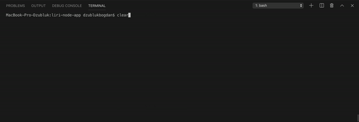

# liri-node-app bot
 # Build with Node.js #
 A command line interface bot that takes in key word commands to return search results from multiple APIs.
 ## Search Commands ##
 * concert-this: returns concert information for an artist from the Bands In Town API
 * spotify-this-song: returns song information and a preview URL for a given song title using the Spotify-Node-API
 * movie-this: returns details about a given movie title from the OMDB API
 * do-what-it-says: runs a given command and search input from a local file

## Directions
Use node to run this program. Use "node liri.js" then run one of the following comands, then add search text:
* concert-this
* spotify-this-song
* movie-this
* do-what-it-says

When running a command follow it by desired text/search. Ex: node liri.js movie-this drive
When concert-this command is used it will return the following:

* Name of the venue
* Venue location
* Date of the Event
When spotify-this-song command is used it will return the following:

* Artist(s)
* The song's name
* A preview link of the song from Spotify
* The album that the song is from
* If no song is provided then your program will default to "The Sign" by Ace of Base.

When movie-this command is used it will return the following:

* Title of the movie.
* Year the movie came out.
* IMDB Rating of the movie.
* Rotten Tomatoes Rating of the movie.
* Country where the movie was produced.
* Language of the movie.
* Plot of the movie.
* Actors in the movie.
* If the user doesn't type a movie in, the program will output data for the movie 'Mr. Nobody."

Technologies Used:
* JavaScript;
* Node.js;
* Spotify API;
* Bands in Town API;
* OMDB API.

